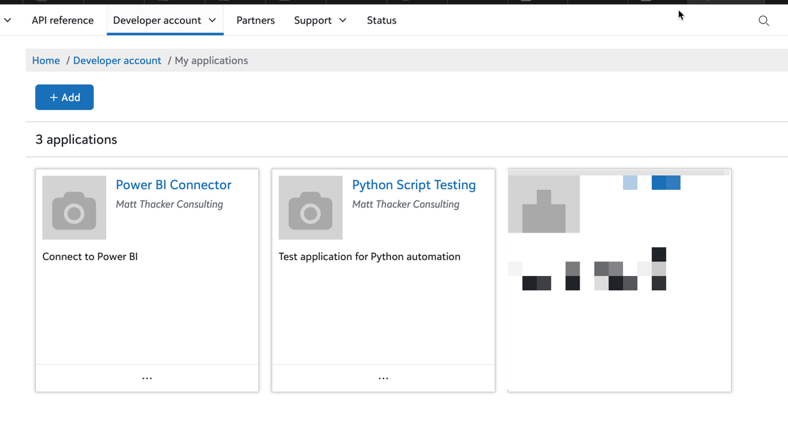
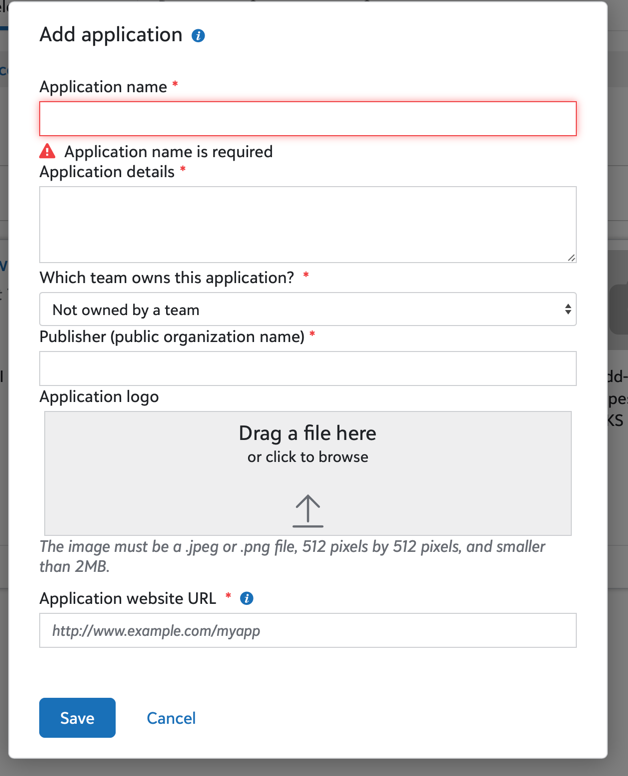
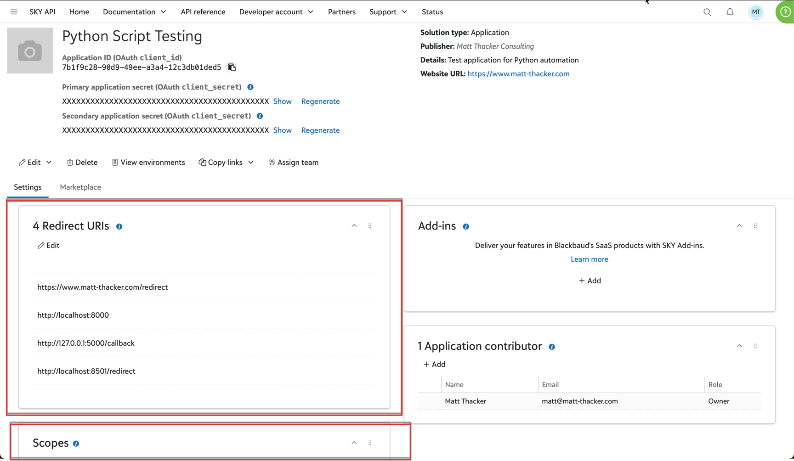
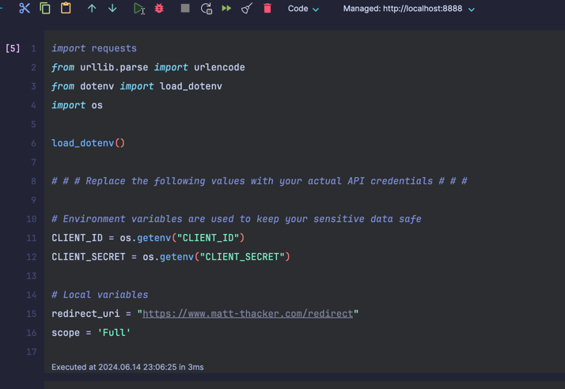
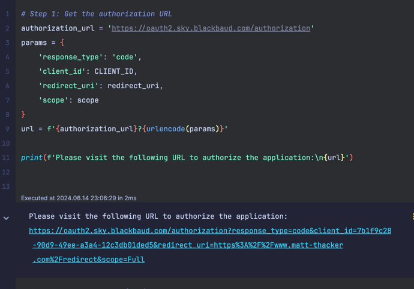
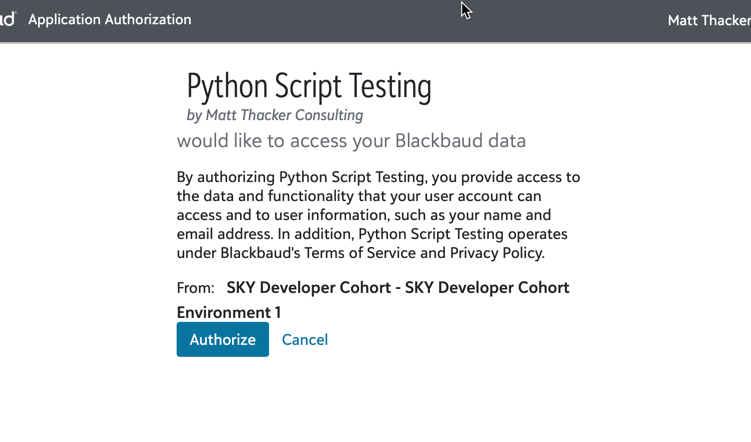
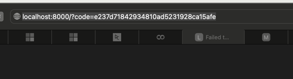
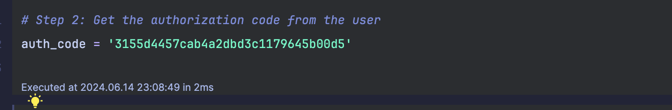
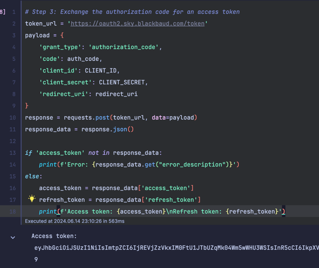
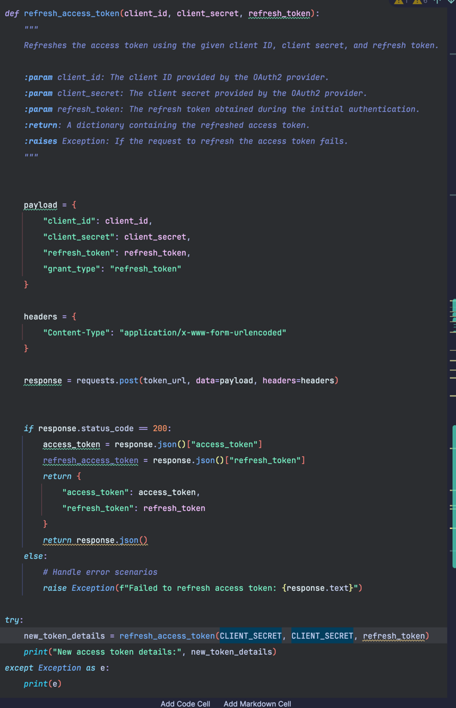

# Blackbaud-SKY-API-Authentication

This is a simple example of how to authenticate with the Blackbaud SKY API using Python. This example uses the requests library to make the HTTP requests.

## Prerequisites
 - A SKY API Deveolper Account
 - Basic knowledge of Python

*If you do not have Python installed on your machine, I'll provide free way to use a Jupyter Notebook in the cloud to run the code.*

## Getting Started

The first step is to log into your SKY API Developer account and create a new application. This will provide you with the client ID and client secret that you will need to authenticate with the API.



**Fill out the required information:**


**You will then set the general information for your app:**

- Properly store Redirect URIs. This is where the user will be redirected after they have authenticated with the API. For this example, we will use `http://localhost:8000`.
- Set the scopes that your app will need. For this example, we will use `Full`.



## IF YOU HAVE PYTHON INSTALLED ON YOUR MACHINE

1. Clone this repository to your local machine.
2. Set up a virtual environment in the project directory.
3. Install the required packages using the following command:
```bash
pip install -r requirements.txt
```
4. Open the Juypter Notebook and run the blocks in the following order:

Cell 1: Import the required libraries and run the cell


Cell 2: Build the url to authenticate with the API and run the cell


Copy and Paste (or select) the URL into your browser and authenticate with the API. You will be redirected to the redirect URI that you set up in your application.

You'll be prompted to authorize your application to access your data. Click "Authorize" to continue.


You will be redirected to the redirect URI with a code in the URL.


Cell 4: Copy the code from the URL (the portion after `?code=`) and paste it into the code cell in the Jupyter Notebook. Run the cell.


Cell 4: Authenticate with the API and run the cell

Nothing will need to be changed in this cell. After running this cell, you will now have an access token (good for 60 mins and a refresh token, good for 365 days) that you can use to make requests to the API.

The access and refresh tokens are saved in variables and do not need to be copied.


Cell 5: Exchange the refresh token for a new access token and run the cell



## IF YOU DO NOT HAVE PYTHON INSTALLED ON YOUR MACHINE

We can use an online Jupyter Notebook to run the code. Below is a link to a Google Colab notebook that you can use to run the code in the same manner as outlined above.

https://colab.research.google.com/drive/16kB5_SwozfHB5feiAbIgNTOY5hI8WIS8?usp=sharing